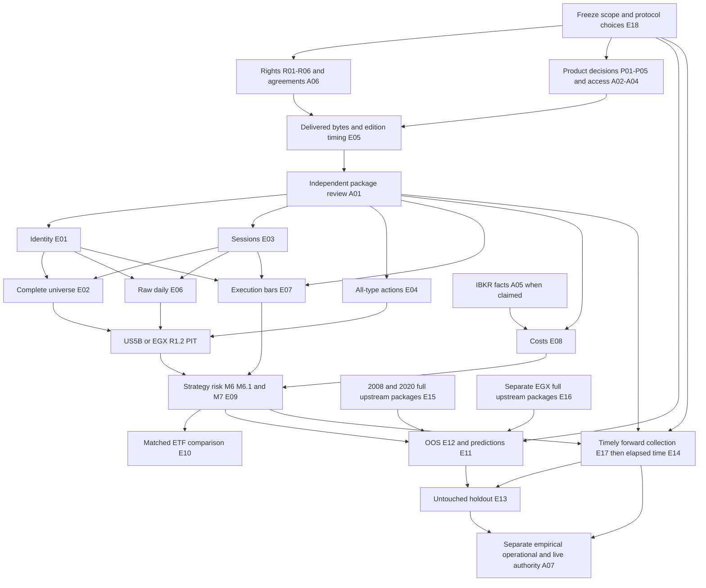

# Phase 4 — evidence authorization and procurement closure

## 1. Starting truth and authority

Assessment date: 2026-09-25. Starting HEAD:
`1d7745f5d2d7da3ce50e145d8d94450c8bedb1ea` (`1d7745f`), branch
`agent/er1c-free-acquisition`, initially clean. The current mission authorizes
`/home/egx-agent/work/egx-trading-platform-us` over the older AGENTS workspace
and branch defaults. Phase 1 REACHED, Phase 2 LOCAL_SCOPE_REACHED and Phase 3
PUBLIC_SCOPE_REACHED remain closed. EMPIRICAL_READY: NO. LIVE_READY: NO.

This is a decision package, not a license, purchase, source attestation, signed
review, research protocol freeze or empirical admission. No external source was
contacted. Source URLs in inherited manifests are identifiers only. No prices
are quoted here; retained prices are only observed Phase-3 public pricing
context, never a current procurement quote.

Authority, in precedence order: this mission; [Phase 3](EXTERNAL_EVIDENCE_EMPIRICAL_READINESS.md);
[Phase 2](EVIDENCE_VALIDATION_READINESS.md); current contracts linked below;
starting HEAD; [Phase-3 manifest](external-evidence/acquisition-manifest.json)
and [audit](external-evidence/admission-audit.json); [Phase-2 inventory](evidence-validation/retained-inventory.json);
Git history. [ER1 acquisition specification](ER1_DATA_ACQUISITION_SPEC.md)
provides the existing scope requirements, not new acquisition authority.

Established authentic canonical PIT, execution, OOS, holdout and forward sample
counts remain zero. The 297 retained daily vendor rows are unadmitted; TWTR's
2022-10-28 row remains quarantined. Government fee-order evidence is one narrow
unreviewed component. Software tests do not create trading evidence.

## 2. Complete blocker inventory and counting rule

There are **36 open closure items**: 6 rights, 5 paid-source, 7 authorization,
and 18 empirical/protocol items. These are distinct decisions or admission
boundaries, not 36 independent datasets. A vendor access row and its evidence
row intentionally describe different obligations. Four closed/excluded rows
below are outside the count. Every item has exactly one current decision class;
secondary dependencies are explicit. P/R/A packet references resolve below.

| ID | Blocker / retained authority | Decision class | Exact closure deliverable / dependency |
| --- | --- | --- | --- |
| R01 | Tiingo retained daily history; Phase 2 A | READY_FOR_RIGHTS_REVIEW | R rights response covering actual retained editions and internal research; not inferred from download |
| R02 | Nasdaq halts and directory; Phase 2 C/J | READY_FOR_RIGHTS_REVIEW | R response separately covering directory and halt products, retention and transformation |
| R03 | NYSE mapping; Phase 2 K | READY_FOR_RIGHTS_REVIEW | R response for historical mapping files, not merely the BQT specification |
| R04 | NYSE actions; Phase 2 I | READY_FOR_RIGHTS_REVIEW | R response for all-type historical event editions and archive |
| R05 | NYSE master; G03 | READY_FOR_RIGHTS_REVIEW | R response for daily master, historical copies and identifier use |
| R06 | EGX research use; G08 / Phase 2 qualification | READY_FOR_RIGHTS_REVIEW | R response for prices/index/universe/actions and research, distinct from structured-product licensing |
| P01 | TradingHours; G04 | READY_FOR_PROCUREMENT_DECISION | P-S sessions specification and budget/contract decision |
| P02 | Cboe; G11 | READY_FOR_PROCUREMENT_DECISION | P-X execution/comparator specification; 2010 start cannot close 2008 |
| P03 | Norgate; G12 | READY_FOR_PROCUREMENT_DECISION | P-H history specification; constituents cannot stand for exchange roster |
| P04 | EGX.news; G10 | READY_FOR_PROCUREMENT_DECISION | P-E Egyptian history specification; seller is not exchange authority |
| P05 | Databento paid usage; G05 | READY_FOR_PROCUREMENT_DECISION | P-X plus P-H only if proven; paid scope/cap separately approved from A03 |
| A01 | Independent review | READY_FOR_INDEPENDENT_REVIEW | Named independent reviewer; initial narrow G14 packet in section 6; future packages reviewed after delivery |
| A02 | NYSE customer access; G03 | READY_FOR_OPERATOR_INPUT | Authorized customer entity, entitled products/archive, approved export custodian; P-N and R03–05 still required |
| A03 | Databento account/API identity; G05 | READY_FOR_OPERATOR_INPUT | Authorized account owner, dataset entitlements, delivery identity and explicit paid/no-paid boundary; no key requested here |
| A04 | ICE client access; G09 | READY_FOR_OPERATOR_INPUT | Authorized client/export custodian, EGX product and archival entitlements; P-E still required |
| A05 | IBKR applicability; G06 | READY_FOR_OPERATOR_INPUT | Section 7 completed with dated documentary support, no credentials |
| A06 | Private agreements | READY_FOR_OPERATOR_INPUT | Contracting entity, authorized signatory, permitted reviewer access, executed scope and rights clauses after separate approval |
| A07 | Production/live authority | DEPENDENT_ON_UPSTREAM_BLOCKER | Separate human authority outside workspace after empirical and operational gates; no procurement or paper result grants it |
| E01 | Historical identity | DEPENDENT_ON_UPSTREAM_BLOCKER | G-I complete dated stable crosswalk, R1 and review |
| E02 | Historical universe | DEPENDENT_ON_UPSTREAM_BLOCKER | G-U complete then-member snapshots, removal histories, identity/session dependencies |
| E03 | Exact sessions | DEPENDENT_ON_UPSTREAM_BLOCKER | G-S every-calendar-date/MIC package, corrections and review |
| E04 | Complete actions | DEPENDENT_ON_UPSTREAM_BLOCKER | G-A all-type bounded ledger or affirmative complete empty coverage |
| E05 | Edition/timing | DEPENDENT_ON_UPSTREAM_BLOCKER | G-T exact consumed editions and field-specific historical availability attachments |
| E06 | Raw daily PIT | DEPENDENT_ON_UPSTREAM_BLOCKER | G-D/G-P reviewed raw rows plus E01–05; quarantine retained |
| E07 | Authentic execution bars | DEPENDENT_ON_UPSTREAM_BLOCKER | G-X final opening-origin M1/M5 segments with actual volume |
| E08 | Authentic costs | DEPENDENT_ON_UPSTREAM_BLOCKER | G-C dated full economics and supported liquidity assumptions; A05 for IBKR claims |
| E09 | Canonical M6/M6.1 and M7 | DEPENDENT_ON_UPSTREAM_BLOCKER | G-M genuine strategy/risk/admission/execute/replay artifacts from E06–08 |
| E10 | Comparable ETF observations | DEPENDENT_ON_UPSTREAM_BLOCKER | G-F matched independently admitted stock/ETF sample, suitability/allocation evidence |
| E11 | Predictive horizons/probabilities | DEPENDENT_ON_UPSTREAM_BLOCKER | Frozen targets/horizons/predictions and matured OOS labels; no elapsed-bar proxy |
| E12 | OOS / M8 / US8 | DEPENDENT_ON_UPSTREAM_BLOCKER | G-O canonical samples, frozen folds/criteria/scenarios and purge/embargo |
| E13 | Untouched holdout | DEPENDENT_ON_UPSTREAM_BLOCKER | G-H pre-outcome freeze and independent non-inspection custody, later interval, matured labels; future interval also E14 |
| E14 | Forward validation | REQUIRES_ELAPSED_FORWARD_TIME | G-V future timely collections and completed observable lifecycles after prerequisites |
| E15 | 2008/2020 stress | DEPENDENT_ON_UPSTREAM_BLOCKER | G-Z era-specific complete packages, not newer-cohort back-projection |
| E16 | EGX empirical coverage | DEPENDENT_ON_UPSTREAM_BLOCKER | G-E separate Egyptian PIT, official index and executable/cost packages |
| E17 | Timely collection / durable MISSED | DEPENDENT_ON_UPSTREAM_BLOCKER | G-V authenticated exact sessions; past missed cutoffs cannot be reconstructed |
| E18 | Unfrozen scope/protocol choices | READY_FOR_OPERATOR_INPUT | D0 below: dates/cohorts/lookbacks/labels/comparators/criteria/cutoffs chosen before outcome inspection |
| C01 | Phases 1–3 / software closure | ALREADY_CLOSED | No implementation milestone reopened; no demonstrated code defect |
| C02 | Retained integrity / bounded source qualification | ALREADY_CLOSED | Phase-2/3 audit records; no admission implied |
| C03 | GLEIF/OpenFIGI narrow reuse questions | ALREADY_CLOSED | Their grants apply only to their data; historical listing scope still insufficient |
| C04 | Synthetic, NAV/Shadow-to-M7/M6 and automatic M4 substitutions | NOT_APPLICABLE | Excluded; never procurement or empirical evidence |

## 3. One dependency graph and exact gate requirements

Arrows mean necessary prerequisites, not sufficient evidence or automatic
approval. R1 review is repeated for each consumed package. Venue-specific
identity/session admission may run independently once its own package is ready.



US8 retains its own US replay request/result authority. Shared M7.1 conversion
requires the explicit US7C compatibility gate; incompatible records remain
explicit exclusions, never manufactured legacy M6/M7/M8 observations.

The V-to-H edge applies to a future holdout; a historical untouched holdout
requires independently evidenced pre-outcome freeze/non-inspection instead.
Forward collection can start alongside historical validation once its own
session, input, review and policy gates pass; it need not wait for OOS results.
Z and EG must each traverse the same full upstream chain in their own market,
era and scope, rather than importing pilot approval.

### Scope dictionary (minimum date and instrument requirements)

**U22:** frozen US pilot 2022-04-01 through 2022-11-04, XNYS common stocks IBM
and historically eligible TWTR, with exact eligibility/suspension/removal states.
This does not demand invented TWTR trading after suspension. Complete XNYS
common-stock universe snapshots must retain every then-member, not just those
two names. Acquire all preceding strategy warm-up sessions and following label
horizons required by the frozen protocol. Existing pilot dates do not specify
those numerical extensions; D0 must supply them before ordering.

**Z08:** contiguous US 2007–2009 coverage; **Z20:** contiguous 2019–2021 coverage.
For procurement request coverage of the entire named calendar years
(2007-01-01–2009-12-31 and 2019-01-01–2021-12-31), extending for frozen warm-up
and labels as needed. This whole-year envelope is a Phase-4 procurement
specification, not an assertion that code hardcodes those endpoints. Then-eligible
era cohorts and full dated membership are required. No IBM/TWTR back-projection.
EGX 2008 remains not testable unless authentic cohort/archive reach is proven;
EGX 2020 requires the 2019–2021 interval if that cohort existed.

**EG:** predeclared contiguous recent EGX pilot, historically eligible persistent
instrument plus at least one later-removed member if that universe had one;
complete daily universe and official index inputs. No exact EGX dates or names
are established by current contracts. D0 must freeze them from dated eligibility
facts, with warm-up and outcome bounds, before acquiring outcome data. A symbol
change/reuse branch must be exercised where evidenced or marked untested.

**F/H/O:** named ETF comparator(s) and then-eligible stock cohort; common matched
periods, horizons and costs. OOS folds must be explicitly dated. Holdout strictly
follows development test windows; intervals use UTC half-open [start,end).
No current frozen empirical protocol supplies a universal number of years,
forward sessions, ETF names or statistical sample target. D0 must provide exact
values and outcome-blind custody. Code's >=2 completed trades in development
and >=2 in holdout is only an engine floor, not a sufficiency recommendation.

**V:** the next genuinely future session with authenticated exact session/cutoff,
then the predeclared forward interval and outcome horizon. Do not label the next
weekday a verified session. The missed 2026-09-13 EGX / 2026-09-14 US targets
cannot become timely observations through historical purchase.

### Gate matrix

All rows require G-T and approved independent review of their exact fields and
scope unless they are derived artifacts whose underlying packages already have
that approval. Costs marked “none at this gate” mean no economics claimed,
not free procurement. The source-field dictionary immediately below is normative
for these procurement packets together with the linked current contracts.

| Gate | Prerequisites and exact admission boundary | Minimum range / instruments | Mandatory content; timing/review; cost requirement | Downstream enabled after all other prerequisites |
| --- | --- | --- | --- | --- |
| G-T | Rights, receipt, edition, attachments; `HistoricalEvidencePackage`, `require_historical_evidence` in `app/research/historical_evidence.py` | Each consumed edition over U22, EG, Z08/Z20 or frozen F/H/O/V | Receipt/hash/bytes/edition/category; scope/fields/revisions; EXACT or bounded availability; exact attachment set; independent approval; latest availability <= relevant decision, receipt/attachments/review <= research build; none at this gate | Every historical admission |
| G-I | G-T; `admit_us_listing_history` in `app/us/historical_identity.py` | Exact required dates for all consumed stable identities in selected scope; no continuity inferred | F-I; approved source continuity/provider bindings; none at this gate | US3/US5A/US7B and PIT |
| G-S | G-T; `admit_us_session_history` in `app/us/historical_session.py` | Every calendar date and declared MIC in selected scope, including closed dates | F-S; correction editions and actual hours, review; none at this gate | US3/US5A/US7B/PIT and future session qualification |
| G-A | G-T and stable identity binding; `admit_us_corporate_action_history` in `app/us/historical_actions.py` | Complete bounded coverage per target stable instrument over selected scope | F-A; all types or explicit evidenced empty ledger; review of completeness and revisions; none at this gate | Split-only PIT transformation, explicit exclusion of unsupported crossed events |
| G-U | G-I/G-S/G-T; `admit_us_universe_history` in `app/us/historical_universe.py` | Every open/early-close date, all members in declared MIC/security-type universe | F-U; complete then-members including removed names, independent completeness checks, availability by decision; none at this gate | Survivorship-safe US5B membership |
| G-D | G-I/G-S/G-T; `admit_us_daily_bar_history` in `app/us/historical_daily.py` | Each eligible open-session date in U22 or other declared scope | F-D; raw OHLCV and anomalies retained; field-specific edition review; none at this gate | Daily PIT when actions/universe also pass |
| G-P | G-I/S/A/U/D; `build_us_retrospective_pit_daily_dataset` in `app/us/retrospective_pit.py` | Common requested bounds and research/decision horizon; enough preceding observations for strategy lookback | Exact dependency identities, exclusion reasons and supported split-only derivation; no later actions projected backward; none at this gate | US research adapter/planning/risk inputs; no automatic M4 mapping |
| G-X | G-I/G-S/G-T; `admit_us_intraday_session` in `app/us/historical_intraday.py`, then US7C replay eligibility | Every required execution session from entry through exit/label; selected stocks/ETFs; M1 or M5 | F-X; final contiguous opening-origin sequence, full session or explicitly eligible bounded coverage; source/bar availability <= execution evidence cutoff, not forced into earlier strategy cutoff; volume mandatory; costs via G-C | Authentic US7C/M6 execution inputs |
| G-C | G-T; applicable fee schedules and liquidity evidence; `PaperExecutionConfig` in `app/paper/models.py`; A05 for IBKR | Every execution date, venue, product, currency and side in each scope | F-C; reviewed dated applicability, fees/minima/FX, spread/slippage and participation support; frozen sensitivity assumptions | Economic M6/M7 replay; narrow G14 alone insufficient |
| G-M | G-P/G-X/G-C and admitted strategy/risk; `replay_us_research_trade`, `build_us_replay_performance_observation` in `app/us/paper_replay.py`; M6/M6.1 and M7 constructors | Each complete lifecycle; all frozen sampled candidates, not only winners | Canonical plan, risk, admission, bars, assumptions, results; exact replay equality; source review inherited; actual supported costs | Net expectancy, PF, drawdown, win/loss, MAE/MFE, R and consistency on authentic sample |
| G-F | G-M separately for stocks and ETFs plus suitability/allocation evidence | Frozen named comparators, matched intervals/horizons/currency/costs | ETF classification and stable dated identities, comparable canonical observations, frozen comparison rule; same review/cost gates | Stock/ETF comparison; classification alone unlocks none |
| G-O | G-M and D0; `ResearchDataset`, `WalkForwardPlan`, `ResearchEvidenceCriteria`; `USReplayFrozenResearchProtocol` / `evaluate_us_replay_research_validation` | Explicit folds, matured training/test labels; era/cohort scope as declared | Fixed strategy/version, purge/embargo, regime definitions, bootstrap and complete declared cost scenarios, evaluation cutoffs; independent protocol/sample review | Development OOS, predictive horizon/calibration only with frozen predictions and labels |
| G-H | G-O, independent custody and frozen later holdout | Exact later untouched interval, labels mature by holdout evaluation cutoff; declared minimum >=2 completed trades | Non-inspection record, protocol hash/freeze clock, exact required scenario sets; same reviewed costs; no holdout bootstrap/tuning | Holdout result, never automatic readiness |
| G-V | Exact future G-S/R1 and timely admitted watchlist/strategy/policies; `complete_watchlist`, `audit_completed_watchlist`, `record_missed_session` in `app/paper/shadow_collection.py` | V; no global forward minimum specified; use predeclared sample goal and full outcome horizon | Section 8 clocks, original evidence and lifecycle/cost observations; review before required freeze/build; Shadow remains NOT SCORED | Forward evidence only within applicable contract; no Shadow-to-M6 conversion |
| G-Z | All corresponding G-T through G-O dependencies for each era | Z08/Z20 then-member universe; authentic EGX reach separately | Same identity, sessions, all actions, raw prices/execution and era-specific costs; review and correction history | Genuine stress validation; no 2022 proxy |
| G-E | Separate EGX G-T packages; `HistoricalPITInput` / `derive_research_pit_daily` in `app/research/historical_pit.py`; applicable EGX execution/M6 admission | EG plus evidenced stress scope and later frozen holdout | F-E, official index and own session/action/identity/universe history; same timing/review and Egyptian costs | EGX PIT then execution/OOS; US facts do not close this gate |

### Mandatory source-field dictionary

- **F-I:** `effective_date`, stable `instrument_id` UUID, `canonical_symbol`,
  `listing_mic`, `security_type`, `currency` (USD in US contract),
  `provider_symbol`, `source_provider`, `source_instrument_key`,
  `is_primary_listing`. Source keys map to stable IDs by dated evidence, never
  by ticker alone. Preserve symbol reuse, both sides of changes and removals.
- **F-S:** `market_date`, `calendar_mic`, `timezone_name` America/New_York,
  `state` REGULAR/EARLY_CLOSE/CLOSED, `opens_at_utc`, `closes_at_utc` (absent on
  closed dates); explicit corrections, not inferred DST or MIC equivalence.
- **F-U:** `effective_date`, `complete`, `members`; each member has stable ID,
  canonical symbol, listing MIC, security type, explicit `eligible`. Include
  negative/ineligible facts and evidence of completeness; absence is not empty.
- **F-A:** stable `instrument_id`, `coverage_start`, `coverage_end`, `complete`,
  `actions`; event identity, type, effective date and exact terms, split old/new
  shares, symbol-change old/new symbols, cash dividend USD amount; mergers,
  spinoffs, stock dividends, rights, delistings and OTHER retained. Event,
  announcement, ex-date, payment, suspension and removal dates stay distinct.
- **F-D:** stable ID, `market_date`, `calendar_mic`, canonical/provider symbols,
  provider instrument key, USD, RAW_UNADJUSTED, open/high/low/close/volume,
  `provider_adjusted_close_reference` (nullable audit-only), `source_provider`,
  `source_snapshot_date`, `source_row_number`, `source_sha256`. Positive coherent
  raw OHLC, nonnegative volume; no interpolated or adjusted execution prices.
- **F-X:** all `US_INTRADAY_EVIDENCE_FIELDS` in `app/us/historical_intraday.py`:
  ID/date/MIC/symbols/provider key/currency/raw basis, granularity,
  `session_sequence`, `interval_start_utc`, `interval_end_utc`, `available_at_utc`,
  OHLCV, `traded_value`, source provider/row/SHA, `provenance_id`,
  `coverage_start_at_utc`, `coverage_end_at_utc`, first/last sequence, `complete`.
  Coverage mode and finality must satisfy canonical segment/bar models. Nullable
  traded value is declared absent, never manufactured. Retain available quotes,
  bid/ask timestamps, trade counts and units for spread/liquidity support.
- **F-C:** evidence for date-effective variable and fixed costs per side, units,
  commission/levy/venue applicability, minima and currency; explicit
  `entry_slippage_bps`, `stop_slippage_bps`, `target_slippage_bps`,
  `scheduled_exit_slippage_bps`, `cost_bps_per_side`,
  `fixed_cost_per_side`, `max_volume_participation_pct` where used. Preserve
  source assumptions and FX treatment separately; do not flatten nonlinear
  minimum/tier costs into an unsupported constant. If current assumptions cannot
  represent applicable economics, report that exact limitation before claiming
  IBKR validation; this phase introduces no tariff adapter.
- **F-E:** `DAILY_EVIDENCE_FIELDS`, `UNIVERSE_EVIDENCE_FIELDS`,
  `IDENTITY_EVIDENCE_FIELDS`, `SESSION_EVIDENCE_FIELDS`, `ACTION_EVIDENCE_FIELDS`
  in `app/research/historical_pit.py` and the models they bind. Daily raw OHLCV,
  stable/provider symbols, snapshot/row/hash, `semantic_class`, `quality_flags`;
  complete dated EGX universe with publication and member eligibility; dated
  mappings; every calendar date's market/instrument state; complete bounded
  action terms. Retain original official index levels, identity, methodology,
  membership/rebalance/publication editions required by the declared strategy.
  VALID_EXECUTABLE needs all OHLCV; SUSPENDED needs affirmative evidence;
  UNSUPPORTED fails closed. EGX execution requires authentic final contiguous
  opening-origin bars at supported granularity with real volume and provenance.
  The `IntradayBar` / `available_bars` boundary in `app/data/intraday.py`
  requires symbol, interval start/end, availability, OHLCV, nullable traded value,
  session ID/date, sequence, phase CONTINUOUS, finality, source/provenance IDs.
  Sequence starts at 1; gaps/overlaps fail; VWAP use requires traded value.
  Index canonical semantics are in `app/data/index_canonical.py`; a valid index
  level is not an instrument execution bar or an automatic M4 strategy input.

## 4. Procurement specifications (requests for decisions, not purchases)

**Common minimum clauses P0 apply to every packet below, including private
agreements and optional extensions.** Vendor response must enumerate each field,
venue, instrument/cohort and date interval as supported or unsupported, identify
all gaps, supply an authorized sample/schema and completeness methodology, and
identify actual source authority. A marketing statement is not acceptance.

Required contract schedule: permission to retrieve the named products; retain
immutable original bytes, receipt metadata and all consumed historical editions
for reproducibility (including an agreed post-termination audit/research archive);
transform and run internal historical research/model training and derived
research outputs; share with named internal users and independent reviewer under
agreed confidentiality; export snapshots and reproduce results without a live
vendor account. Specify storage jurisdictions, users/applications and any
third-party exchange/identifier pass-through restrictions. If indefinite archive
is unavailable, operator/legal must approve a stated retention term and explain
how required reruns remain lawful; otherwise admission use is blocked.

No public raw-data redistribution is required for the current internal work.
Explicitly resolve whether publishing aggregate non-reconstructive research is
permitted before any later publication. Do not purchase redistribution rights
by default or publish without them. Distinguish legal permission from technical
coverage and from independent evidence review.

Delivery: versioned downloadable files or separately authorized API exports,
complete bounded snapshots plus correction lineage; original bytes, byte counts,
SHA256, record locators, schema/encoding/units/timezones, source version IDs,
publication and revision timestamps, effective dates and actual acquisition
clocks. A latest-only API without retained exact editions and availability proof
is unacceptable. Source publication/correction clocks must permit EXACT or
bounded R1 proof of every consumed version. Export/download reproducibility and
rights survive enough to repeat each admitted build. No credentials belong in
this repository or questionnaire.

| Packet / sources / blocker IDs | Required role, scope, frequency and fields | Session/action/edition requirement; unacceptable gaps | Required decision and acceptance |
| --- | --- | --- | --- |
| P-S TradingHours (P01) | Exact sessions: U22 XNYS every calendar date; separately quote Z08/Z20 and each additional ETF/EGX venue selected by D0. Daily open/early/closed F-S with exact UTC hours | Historical revisions, special closures and correction availability; general recurring schedules, skipped closed dates and inferred MIC mappings fail | Budget owner chooses bounded session scope; legal P0; source reviewer G-T/S. Does not buy identity/actions/bars |
| P-X Cboe (P02) | Execution OHLCV plus quote/spread support for U22 stocks and D0 matched ETFs; M1/M5, F-X/F-C; Z20 and later holdout/forward exports if expressly covered | All required lifecycle sessions, venue coverage, original/unadjusted prices, actual volume/finality/sequence, timestamps and correction history; linked identity/session/actions separately admitted | Quote exact coverage and usage/retention rights under P0. Retained advertised start 2010 excludes Z08: decline that role or obtain a separately authorized complete source; never silently shorten stress scope |
| P-X Databento (P05/A03) | Same F-X execution role for chosen US stocks/ETFs and scope; any master/action/history add-on must independently satisfy P-H/P-N | Exact dataset/schema, exchange entitlements, archived editions and historical availability; credits/account existence alone supplies nothing | Separate operator account identity/entitlement decision, authorized custodian, written usage cap and no unapproved paid overage; price supplied by vendor, not invented |
| P-H Norgate (P03) | U22, Z08, Z20 and D0 holdout: raw daily F-D, delisted histories and dated F-I/F-U; stable provider keys and complete historical members | Split/dividend capability is not complete F-A; index constituents are not complete XNYS common-stock roster. Require explicit unsupported roles and original edition/PIT lineage, not today's revised backfill | Decide subscription/export rights only after written P0 and field/role acceptance. Full universe/actions/session/execution gaps require separate suppliers; no all-in admission claim |
| P-N NYSE customer mapping/master/actions (A02/A06/R03–05) | U22 complete XNYS common-stock roster F-U, stable primary listing/provider crosswalk F-I and complete per-instrument F-A; daily historical files and event revisions. Additional venues/types/eras only if specified | Mapping schema != historical files; action coverage all types including explicit empty. Exact historical source editions and corrections. Retained master archive starts 2015-12-16: cannot close Z08 | Operator names customer/export custodian, legal clears each product/archive/identifier license, procurement obtains scope-specific offer if charged. No dashboard/IP/SSH setup now; separate source for unsupported era |
| P-E EGX.news (P04) | EG and separately Z08/Z20 where authentic: original daily prices/index F-E and M1/M5 execution/volume F-X-equivalent at EGX-supported granularity | Seller must identify provenance, exact EGX instruments/currency/units, original editions, source timing and corrections; daily/minute CSV advertisement proves neither full PIT nor completeness | P0 plus underlying EGX/third-party rights, explicit unsupported identity/universe/actions/index/session roles; accept only documented role, not a bundled readiness claim |
| P-E ICE EGX (A04/A06) | Same EGX scope; ask for complete archival price/execution/index roles and separately specified identity/universe/actions/session components | Client feed access is not historical archive/PIT proof. Exact 2008/2020 depth, retained original versions, publication/correction chronology and exportability must be documented | Client owner supplies authorized delivery/entitlements and contract scope. Any charged archive/feed use needs new budget approval; no client login or contact now |
| P-R Tiingo / Nasdaq private rights supplements (R01/R02/A06) | Tiingo retained U22 daily F-D; Nasdaq exact dated directory F-I/F-U only if actually complete, issue-specific halt/resumption facts where required | Retained receipts/specs cannot supply missing historical editions; Nasdaq non-NASDAQ marker is not XNYS; scheduled resumption is not executed resumption | Written P0 grant and exact product/date applicability; no new retrieval authorized. Halt/directory rights cannot establish all-type actions or full exchange membership |
| P-R direct EGX rights/archive (R06/A06) | Official EGX F-E price/index/universe/action/session products over EG and proven stress eras | Research use and original archive rights separate from structured-product license; no inferred historical depth or current-member projection | Legal grant plus scope-specific archive offer and independent review; if unavailable E16 remains blocked |
| P-C private broker/cost schedules (A05/A06/E08) | Dated applicable public/private schedule and account-fact extracts for all claimed execution dates/venues/products/currencies; F-C and section 7 | Historic changes/minima/tiers/FX and supporting spread/participation evidence; current generic tariff alone unacceptable | Operator-controlled minimal redacted export; P0 as applicable to retention/internal review. No broker access or trade authority implied |

Buy only roles that can satisfy admission. No vendor is ranked. One supplier
may fill several explicitly accepted roles; none is presumed to close unrelated
gates. Acquisition of stress, holdout and EGX evidence remains mandatory for
those claims even if the first U22 admission succeeds.

## 5. Rights-clearance pack

Legal/vendor management must return a signed, dated, product/edition-specific
answer to **each** question below for R01–R06 and every private P0 agreement.
Attach controlling terms and clause/page identifiers, contracting entities,
applicable dates and any conditions. “Publicly accessible” is not an answer.
This is a request for qualified resolution, not a legal conclusion.

1. Is the exact retrieval method permitted for the named artifact/product and
   entity? Does the answer also cover previously retrieved retained editions?
2. May original bytes, metadata and normalized copies be stored locally? Where,
   by which users/applications, and for what period?
3. May historical editions/corrections be archived for audit and replay after
   subscription termination? What deletion requirements apply?
4. Are normalization, identity crosswalks, split-only transformations and joining
   to other licensed data permitted? Are derived values still restricted?
5. Are derived internal research outputs permitted, including performance and
   reproducibility artifacts? Can any output expose/reconstruct source data?
6. Are internal model training, backtesting, research and paper simulation
   permitted? What separate approvals/fees or use restrictions apply?
7. May internal collaborators and an independent reviewer inspect the exact
   bytes/attachments? Identify named-user, affiliate and confidentiality limits.
8. Is aggregate research publication allowed; what constitutes redistribution?
   Raw publication is not currently required. Record NOT_APPLICABLE for that
   intended use without implying permission for future publication.

| Source | Additional exact questions / material to review |
| --- | --- |
| R01 Tiingo | Do controlling terms for the retained IBM/TWTR daily artifacts permit archival research and transformations? Does any upstream exchange right constrain internal derivation or review? Phase-2 A manifests identify bytes/receipts |
| R02 Nasdaq | Answer separately for directory snapshots and halt feed/history, including archive/retention limits, automation, derived halt states, internal sharing and non-Nasdaq instruments; inspect Phase-2 C/J retained terms and fields, not a new rights search |
| R03 NYSE mapping | Does permission extend from published BQT documentation to actual dated mapping files, historical archive and stable identifier crosswalks? Are exchange/identifier sublicenses required? Phase-2 K |
| R04 NYSE actions | Are full historical event files, corrections, negative complete coverage and derived research use licensed? Distinguish temporary public upcoming/removal notices from customer archive rights; Phase-2 I |
| R05 NYSE master | Is retained historical master data/export licensed, including post-termination archive and independent review? Are customer access and data-use permissions separate? G03 v4.0.6 specification is not the grant |
| R06 EGX | Which permission governs raw prices, index levels/methodology/membership, universe, sessions and corporate actions for internal research? Does structured-product text apply at all to this use? Who can grant underlying rights when ICE/EGX.news delivers? G08 is insufficient |

A rejected right closes the vendor decision as rejected, not the empirical
requirement. Record the affected role and seek a separately authorized supplier;
never infer a substitute license from GLEIF/OpenFIGI/GovInfo grants.

## 6. Independent-review packet

A01 is ready for reviewer assignment and the narrow G14 review. Other packages
are pending their specified upstream deliverables. The autonomous agent cannot
independently approve its own work. Require an authorized human who did not
prepare the availability claim or select the empirical outcomes; record name,
organization/role, independence/conflict declaration and authority to review.
An identity string in a model does not establish independence.

**Immediate subject:** SEC Release 34-94644, FR Doc. 2022-07881, 87 FR
21931–21938, Federal Register Vol. 87 No. 71; order dated 2022-04-08, published
2022-04-13, effective 2022-05-14. Claimed narrow fact: Section 31(b)/(c) charge
USD 22.90 per USD 1,000,000 from that effective date. This is not an all-in
broker rate, permission to apply it to an account, proof of rates before May 14,
or proof that no later order superseded it.

The exact source identities, resolved/requested locators, request and receipt
UTC clocks, byte lengths, hashes and receipt paths are already retained in the
Phase-3 manifest, indexed by the following artifact names. The manifest SHA256
is `5031e650a7cb662a1147476aac0d0e4720512d33176ce69c205e30fb3f6441aa`.
Use it directly; do not reacquire any source. Raw root:
`/home/egx-agent/research-data/phase3/20260925T161516Z-public-qualification/`.

| Role / artifact | SHA256 | Actual receipt UTC |
| --- | --- | --- |
| Subject HTML `govinfo_fee_order_2022.html` | `7065dc5e97773e108eb8e07da3242f629be579bb534bd2600d696e5da9f5b384` | 2026-09-25T16:17:49.073141Z |
| Exact printed edition `govinfo_fee_order_print_2022.pdf` | `09da44f8651bd1510f1dad7e78a40989dabf22c2ca3e177b382d6891467b185c` | 2026-09-25T16:18:04.304374Z |
| Publication metadata `federalregister_fee_metadata.json` | `c01bd14cdc9415885a50ef3497569046f4454180e0d08894b7962a390bc1d564` | 2026-09-25T16:18:04.862780Z |
| Government-works policy `govinfo_policy.html` | `d9e3a2f1cb4486ab4ecc4eff640f94f9a9bb8655ca71ff00694b236e7011ad1c` | 2026-09-25T16:17:31.068071Z |

Subject HTML canonical receipt identity in the Phase-3 audit:
`cf923cdf2da178ca04e314f714599ef68144bb3f5168ca48f84f0b9a049ea851`.
The PDF can be a separately reviewed subject if consumed directly. Attachments
must be constructed from the actual PDF/publication/policy source material with
locator, hash, receipt clock, description and source-authority context. R1 binds
exact attachment identities **and** SHA256 in evidence and review, with no
missing, extra or substituted attachment. This document is an unsigned task
packet, not that approval or an invented canonical attachment record.

Reviewer procedure and explicit approve/reject questions:

1. Rehash raw bytes and original receipt sidecars against manifest; confirm
   subject receipt identity, source authority, edition/page/document identity
   across HTML/PDF/metadata. Approve or reject exact edition correspondence?
2. Is the claimed charge, units, legal scope and effective date supported by
   specific pages/clauses? Approve only those fields; identify unsupported
   account/venue/date uses and any missing supersession evidence.
3. Do publication/filing attachments prove availability of the **consumed
   edition**, not just existence of a similarly named order? Supply an EXACT
   UTC clock or defensible inclusive interval and conversion method. No midnight
   default from a calendar date. Can its latest bound precede the relevant
   simulated decision? If not, reject that use.
4. State revision semantics and scope/completeness limitations. Does this edition
   remain applicable across every proposed execution date? Approve or reject
   each bounded claim; no complete cost-set approval from this one artifact.
5. Do the exact attachments support every claimed field and scope? Are the
   government-authored rights basis and third-party exclusions correctly bounded?
6. Record methodology, checks and limitations; approve/reject the exact subject
   hash, availability-evidence identity and attachment set. Sign/date the human
   attestation with reviewer identity and actual UTC review time. R1 stores
   `reviewer`, `reviewed_at`, `methodology`, `approved`, subject IDs/hash,
   `availability_evidence_id`, exact attachment references. It does not implement
   cryptographic human signatures: retain the signed attestation as governance
   evidence, without claiming the constructor verifies it.

For every later supplier package use the same form plus: date/MIC/instrument
coverage matrix; mandatory-field map; complete/empty/unavailable distinctions;
all-type actions and correction lineage; independently checked roster/removal
completeness; raw record locators; rights determination; anomaly/exclusion log.
Receipt, attachment and review clocks must be <= actual research build; historical
availability latest bound <= relevant strategy or execution-evidence cutoff.
Approval is scoped per package; no blank or blanket portfolio approval. A
reviewer cannot sign away missing source facts. G14 cryptographic PDF signature
validation has not been performed; do not claim it.

## 7. Minimum IBKR operator-input packet

No credentials, full account number, private portal access or trade instruction
is requested. The authorized owner can supply a minimal redacted, dated
attestation/extract and controlling schedule references through an approved
channel after separate authority. Return “not applicable” only with a reason.
Public G06 stock/FX pages are schedule context; their current editions do not
establish historical rates or this account's applicability.

| Required fact | Exact operator response required / why |
| --- | --- |
| Legal scope | IBKR contracting legal entity, account jurisdiction/residency classification relevant to pricing, and applicable dates; establish schedule applicability |
| Account/product scope | Account type and named exchanges/products/security types/routes where fee treatment differs; confirm relevance of each proposed research instrument |
| Plan/tier | Fixed/tiered or other applicable plan, actual volume tier/qualification facts where required, and change-effective dates; no assumed lowest tier |
| Commissions | Applicable per-share/notional/fixed charges, per-order/per-side minima/maxima, routing and order-size applicability, source edition and effective dates |
| Other charges | Applicable regulatory/exchange/clearing fees, taxes, pass-throughs/rebates if relevant, side and quantity/notional basis; prevent omission or double count |
| Currency | Trade/settlement/account reporting currency and conversion required for the proposed comparison; no invented FX conversion if none is required |
| FX path | Manual vs automatic conversion or pre-funded currency path as applicable; currency pair/direction, when conversion occurs, dated commission/minimum and spread treatment, rates/source and avoidance of double counting |
| Exceptions | Any private agreement or exemption that changes only the above economics, supported by a minimal dated extract and reviewer access permission |

Operator must distinguish verified historical account facts from proposed
future paper assumptions. If no applicable historical account existed, do not
claim actual IBKR historical economics; separately declare supported scenario
assumptions and their limits. No new broker-specific tariff schema is required
by this phase. Independent reviewer checks applicability and source editions;
research owner maps only representable economics into F-C and preserves explicit
scenario assumptions. No answers are guessed here.

## 8. Forward-time requirements

Next events, after separately authorized inputs and reviewer availability:

1. Freeze D0 strategy/version, market/cohort/comparators, prediction/label
   horizons, dates, criteria, scenarios and evaluation cutoffs before outcomes.
   Authenticate the next exact session and cutoff from reviewed evidence. For
   `ShadowSession`, decision cutoff <= session open. No universal HH:MM is
   specified by these contracts; operator must supply exact UTC values backed
   by session truth. EGX/US dates are not interchangeable.
2. Before that decision cutoff obtain admitted evidence available by information
   cutoff and generate the genuine watchlist. Required order:
   `information_cutoff <= generated_at <= freeze_receipt <= completed_at
   < decision_cutoff`. Completion and final publication must occur before
   cutoff, with no future clocks/rollback. Recheck package receipt/review at
   freeze receipt time; post-close evidence cannot become pre-market truth.
3. Freeze applicable execution/fill policy before its trigger publication and
   effective by the required information cutoff; retain trigger, bar, source
   availability, actual volume, sizing/risk, fill/exit and cost evidence through
   the real lifecycle. Policy/assumption validity is not authentic execution
   proof. Maintain eligible non-trades, exclusions and missing outcomes without
   selection on future performance.
4. Audit immutable completion and lifecycle receipts. A frozen file alone is
   not completed collection. `record_missed_session` can record MISSED only
   after cutoff with approved exact session evidence; unknown session truth
   remains NOT SCORED, not a fabricated durable MISSED record. Never reconstruct
   an earlier watchlist after observing outcomes.
5. An economic observation becomes eligible only with genuine canonical
   admission/result, completed exit whose `known_at` matures after decision and
   by evaluation cutoff, and exact supported costs. US8 requires execution
   evidence cutoff <= evaluation cutoff, request build
   <= caller runtime research build, and caller build >= evaluation cutoff.
   Runtime build clocks are not historical information cutoffs. Training labels
   must be strictly before the test information cutoff and pass purge/embargo.
   Holdout evaluation cutoff >= holdout end and labels must have matured.

There is no fixed contract-wide minimum of forward sessions or trades. D0 must
predeclare a defensible forward sample target and deadline; maturity and criteria
remain mandatory. `ResearchEvidenceCriteria` requires explicit development and
holdout completed-trade minima each >=2, and declared economic thresholds; two
trades is not empirical sufficiency. Bootstrap block length and actual sample
size can make evidence insufficient even at that floor. Empty watchlists,
unfilled candidates and Shadow valuation intervals are not completed M6 trades.

Elapsed future session time, bar publication, entry/exit/horizon maturity and
future untouched holdout outcomes cannot be accelerated by historical purchases.
Past data can support historical OOS after proper admission; it cannot create a
missed freeze, retrospective non-inspection or a new forward observation.
Shadow collection remains EXPERIMENTAL/PAPER/NOT SCORED under its own contract;
no Shadow-to-M6, NAV-to-M7 or automatic strategy mapping is authorized.

## 9. Prioritized closure plan and exact operator decisions

Priority follows prerequisite reach; rows are not vendor rankings. Rights/access
inquiries below are **operator decisions to authorize later work**, not messages
sent in this phase. No final purchase approval is requested from an unspecified
quote. The packets make scope reviewable; a binding offer remains an external
deliverable before purchase.

| Order / decision | Blockers resolved; owner | Required authorization and external deliverable | Admission test afterward | Downstream set enabled conditionally |
| --- | --- | --- | --- | --- |
| D0 | E18; research owner with independent protocol custodian | Approve U22 unchanged plus exact warm-up/label extensions; separately freeze EG dates/cohorts, era cohorts, ETF list, OOS folds, untouched holdout boundaries/custody, future cutoffs, sample minima/economic thresholds/scenarios; no outcome inspection | Canonical `WalkForwardPlan`, `ResearchEvidenceCriteria`, `USReplayFrozenResearchProtocol` validation; scope consistency check | All scope-specific orders and later validation; does not admit data |
| D1 | R01–06, A01/A02/A06; legal, data owner, independent reviewer sponsor | Authorize bounded rights/vendor-scope review of the complete U22 foundation package P-N + P-S + retained daily rights, separate Nasdaq/EGX use reviews for R02/R06, and appoint reviewer. Obtain grants, archive/timing/completeness commitments and documented access authority; no purchase until quote reviewed | G-T/I/S/A/U/D then G-P; focused R1/US1–5B tests plus actual package admission | Largest common prerequisite set: PIT, execution, M6/M7, comparator, OOS/holdout and forward inputs; era/EGX only with separate matching coverage |
| D2 | P01/P03 and any charged P-N, E01–06; budget owner/procurement/data custodian | Decide exact bounded offers after D1 legal/scope acceptance; approve named products, price/usage cap, delivery and retention; supply genuine original history and review attachments | Section 10, all foundation admissions and pilot auditor; retain failures | First authentic US PIT pilot; no execution economics yet |
| D3 | P02/P05, A03/A05, E07–10; data/broker-account owner, procurement, reviewer | Select compliant execution/quote offer by scope, authorize delivery/usage separately, supply IBKR questionnaire and cost evidence; comparator list from D0 | G-X/C/M/F, US7B/US7C/M6/M7 and comparator evidence review | Authentic economic observations, matched ETF research, OOS inputs |
| D4 | E17/E14; collection operator/reviewer | Authorize future paper evidence collection with authenticated sessions, timely frozen input/policy and observed lifecycle/costs; actual wall-clock events | `audit_completed_watchlist` / MISSED audit, applicable canonical observation admission; no conversion of Shadow | Forward evidence accrual; start as soon as its prerequisites pass, in parallel with D2/D3 historical work where possible |
| D5 | E15/E16, P04/A04/R06; research/legal/procurement and EGX data custodian | Approve role-specific stress/EGX offers with proven Z08/Z20/EG completeness, rights and costs; separate markets/eras | Full same-market upstream admissions, G-Z/G-E then research validation | Stress and EGX empirical coverage; no substitution from U22 |
| D6 | E11–13; research owner and independent holdout custodian | Deliver authentic frozen predictions/canonical datasets, completed labels, custody and all declared scenarios; release holdout only at frozen evaluation time | M8/US8 development/evidence/scenarios/holdout/final validation functions | Measured OOS/predictive/holdout results; failures stay visible |
| D7 | A07; separate human production authority | Only after empirical/operational requirements are met, separate explicit written production/live decision outside this workspace | Separate authorized operational review; none run in Phase 4 | No live readiness claimed or granted here |

**Exact next action with the largest downstream reach:** the operator assigns
an independent reviewer and authorizes legal/data-owner review of **D1's combined
U22 identity + complete universe + exact sessions + all-type actions + retained
daily edition/rights packet**, with D0's missing lookback/label bounds completed.
Request a field/date/rights/edition acceptance response under P0/P-N/P-S before
any purchase. A standalone fee-order review is immediately actionable but cannot
unlock as many gates; a standalone execution-bar purchase leaves PIT blocked.

Procurement decisions: five explicit paid paths P01–P05, plus scope/offer
approval for NYSE/ICE/direct EGX/private-rights or private cost products if
selected and charged. None is a requirement to buy all named vendors. Rights
decisions: six R rows, each with eight separate use questions. Review actions:
appoint authorized independent reviewer, decide narrow G14, then approve/reject
each delivered exact package and independent protocol/holdout custody. Operator
inputs: A02–A06 plus D0, with A01 reviewer appointment; A07 remains separate.

## 10. Post-procurement admission procedure

Run only in a later authorized evidence milestone. Contract regression tests
are software checks, never substitutes for actual package admission.

1. Check signed rights/access scope and purchased role against the frozen order;
   record vendor omissions as explicit failures. Receive original bytes once
   under authority, retain receipt/edition/byte count/hash/row locators, corrections
   and archive inventory. No latest-version overwrite or silent normalization.
2. Rehash every raw artifact and attachment; verify delivery/schema, dates,
   stable identities, every required calendar date, all members/actions and
   complete-or-evidenced-empty declarations against the order. Quarantine
   conflicting OHLC/volume/status; preserve TWTR quarantine unless authentic
   evidence resolves the exact conflict under review, never by convenience.
3. Construct exact R1 receipt, scope/field availability evidence and attachment
   records from source truth. Independent reviewer supplies actual signed scoped
   decision; enforce identity/hash/edition/set equality and clocks with
   `require_historical_evidence`. Reject absent historical edition proof even if
   purchased data is numerically coherent. Rights remain a separate legal gate;
   R1 constructors do not authenticate licenses or human independence.
4. Admit US listing and session histories, complete action and universe histories,
   raw daily history; compose US5B only on common admitted horizons. Check all
   eligible dates and record supported exclusions. For EGX use its own
   `HistoricalPITInput` and `derive_research_pit_daily`; do not use operational M3
   fallback or force a day VERIFIED. Official index inputs need their own gate.
5. Separately admit US7B segments and recheck US7C opening-origin/continuity and
   multi-session eligibility; admit EGX execution through its existing boundary.
   Bind real volume and supported F-C assumptions. Preserve unsupported cost
   mappings as limitations, not validated economics.
6. Run authentic canonical strategy/risk and M6/M6.1 replay; construct M7/M7.1
   observations only from exact replayable inputs/results. Retain admission
   failures, rejected/no-fill candidates and economics; no fake trades.
7. Record package/receipt/review identities, code HEAD, frozen protocol identity,
   input/output hashes, commands and actual admission outcomes. Rerun relevant
   contract tests before accepting the build. A PASS on fixtures does not turn
   a rejected real package into an admitted sample.

Regression anchors: `tests/test_r1_historical_evidence.py`,
`test_r1_2_historical_pit.py`, `test_us1_historical_identity.py`,
`test_us2_historical_session.py`, `test_us3_historical_daily.py`,
`test_us4_historical_actions.py`, `test_us5a_historical_universe.py`,
`test_us5b_retrospective_pit.py`, `test_us7b_historical_intraday.py`,
`test_us7c_b_paper_replay.py`, `test_m6_paper_execution.py`,
`test_m6_1_paper_replay.py`, `test_m7_performance.py`,
`test_m7_1_replay_performance.py`, `test_m8_research.py`,
`test_m8b_evaluation.py`, `test_us8_replay_validation.py`,
`test_shadow_collection.py` (all under `tests/`).

## 11. Downstream empirical validation sequence

After admission, inspect data-quality/bias exclusions and exact lifecycle replay;
then compute net expectancy, profit factor, drawdown, average win/loss, MAE/MFE,
R-multiples, capacity/position/portfolio risk and consistency with actual supported
costs. Keep stock/ETF periods and assumptions matched. No hit-rate optimization.

Execute frozen purged rolling development OOS with training label cutoff and
embargo; evaluate all declared cost scenarios and regimes, including authentic
2008/2020 coverage where required; bootstrap only eligible development samples
and preserve insufficient-evidence reasons. Freeze predictions/label definitions
before using outcomes for probability/horizon assessment. Release untouched
holdout under independent custody only at the frozen evaluation cutoff, with
matured labels and exact scenario completeness. US8 final report binds protocol,
selected evidence and all development/holdout results; do not silently select
later revisions after cutoff or tune against holdout. Accumulate genuine forward
samples separately and wait for maturation. Assess EGX on its own admitted data.

A completed empirical run may reject the strategy. Purchasing complete inputs,
passing software tests or satisfying the engine's minimum trade count does not
establish profitability, empirical sufficiency or production authorization.

## 12. Residual risks, verification and handoff

Unresolved external facts are now explicit deliverables: vendors may not provide
original PIT editions, all-type action completeness or review/archive rights;
then that role remains inadmissible. NYSE master and Cboe documented start dates
leave 2008 gaps. Historical data cannot restore lost forward cutoffs or spoiled
holdouts. Account facts may make generic assumptions inapplicable. Complete
fees still do not establish spread, impact or fills. Unsupported action crossings
remain excluded, not implemented around. Cross-market/session/currency inference
and survivorship filtering remain prohibited. Human attestation, clock/storage
trust and unsigned/public documentation limits remain explicit.

Only this authoritative document is proposed as a repository change. No product
software, tests, evidence bytes or previous phase records were changed. Network
and external API calls: zero. No paid usage, private accounts, credentials,
contracts accepted, external messages, broker actions, production access,
database/service changes, deployments or direct Git staging/commit/reset/restore/
checkout. Test network denial is enforced by `tests/conftest.py`.

Focused offline contract regression: **1047 passed in 95.74s (0:01:35)**.
Exact command:

```sh
PYTHONDONTWRITEBYTECODE=1 /home/egx-agent/work/egx-trading-platform/.venv/bin/python -m pytest -q -p no:cacheprovider tests/test_r1_historical_evidence.py tests/test_r1_2_historical_pit.py tests/test_us1_historical_identity.py tests/test_us2_historical_session.py tests/test_us3_historical_daily.py tests/test_us4_historical_actions.py tests/test_us5a_historical_universe.py tests/test_us5b_retrospective_pit.py tests/test_us7b_historical_intraday.py tests/test_us7c_b_paper_replay.py tests/test_us8_replay_validation.py tests/test_m6_paper_execution.py tests/test_m6_1_paper_replay.py tests/test_m7_performance.py tests/test_m7_1_replay_performance.py tests/test_m8_research.py tests/test_m8b_evaluation.py tests/test_shadow_collection.py
```

Log: `/home/egx-agent/er1-autopilot/state/phase4-focused-tests.log`; SHA256
`193241a23e05d9ab28429b98617d3428c5d80d56d499dd262ba71580891825aa`.
No full suite rerun: documentation only. Phase-2 results are historical, not
represented as a Phase-4 run. Empirical tests: NOT RUN, no admitted inputs.
`git diff --check` and explicit new-file whitespace/path/count/contract-reference
checks passed; new-file diff reviewed. `git diff --no-index` returns 1 for this
new-file difference, with no whitespace diagnostics. Rehashed all 24 Phase-3
response bodies and bound original receipts, the pinned Phase-3 manifest, and
all 67 Phase-2 inventory files: unchanged. Exactly one untracked document and
an empty index were verified before handoff. No software defect was found.

The supervisor bridge request uses `message` and `paths` in
`/home/egx-agent/er1-autopilot/state/COMMIT_REQUEST.json`, message
`docs: define evidence authorization and procurement closure`, exact path
`docs/EVIDENCE_AUTHORIZATION_PROCUREMENT_PLAN.md`. The existing bridge is
supervisor-owned and includes a private-token guard; this agent does not execute
that guard or access its token. After supervisor commit, the next read-only
cycle must verify the resulting HEAD, exact committed paths, clean worktree,
unchanged source metadata and successful checks before terminal DONE. This text
does not assert a future commit has happened.

## 13. Terminal status

Substantive packet: **AUTHORIZATION_CLOSURE_STATUS: DECISION_PACK_READY**.
**EMPIRICAL_READY: NO. LIVE_READY: NO.** All 36 open items have an exact next
deliverable/decision; none has been represented as purchased, licensed, reviewed
or admitted. Administrative commit/final verification is pending the supervisor.
Terminal target after that verification is AUTOPILOT_STATUS: DONE; until then the
cycle report uses CONTINUE. No new empirical work is authorized by this document.
